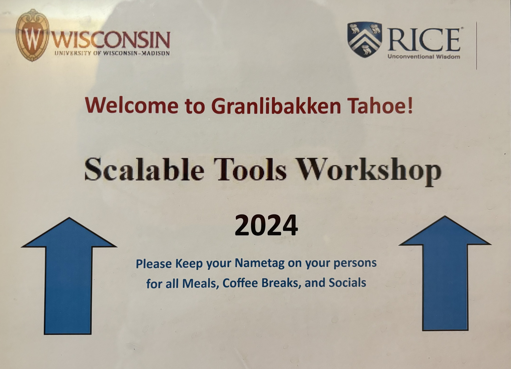

          

The *15th Scalable Tools Workshop*
(formerly the Petascale Tools Workshop and
CSCADS Workshop on Petascale Tools)
will be held {{site.data[page.year].dates.startdate | date: "%A, %B %-d"}}-{{site.data[page.year].dates.startdate | date: "%s" | plus: workshop_len |  date: "%A, %B %-d"}} this year at the Granlibakken Resort in Lake Tahoe, California.
As in previous years, we will begin with presentations of people's work,
and will then break up into working groups to tackle real technical problems
for the second half of the workshop.

On Sunday evening, the welcome reception starts at 5:30pm and dinner at 6:30pm.

